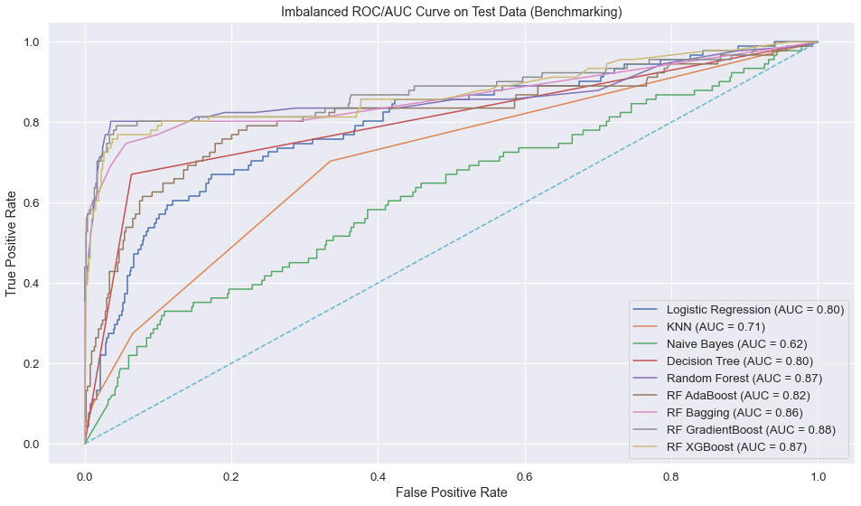

[](https://mybinder.org/v2/gh/Skellet0r/customer-churn/master)

# Telecommunications Customer Churn Classification

This is a classification project, aiming to predict which customers will soon end their service plan with our client.
This has a large business value to our client as their customer churn rate is above 14%, and lowering that rate means
more profit.

The presentation delivered to stakeholders for this project can be found [here](https://Skellet0r.github.io/customer-churn).

## Components

- [Charter](docs/project/charter.md): the project charter was the first step when
  starting this project, and is a sort of outline of this project. It clarifies
  who our stakeholders are, what we aim to do, and how we intend to complete this
  project. If this is your first time looking at this project, the project charter
  is the best place to start.
- [Exit Report](docs/project/exit-report.md): a quick outline of the end results of this
  project. It isn't an exhaustive report, however along with the project charter it gives
  a quick overview of what this project is and what was accomplished.
- [Data](data/): this is where data used in this project is stored. It is separated by
  which phase the data is in, either raw, interim, or processed.
- [Notebooks](notebooks/): this is where all the jupyter notebooks for this project are
  stored. Instead of having one behemoth of a jupyter notebook, there are multiple
  distinct notebooks each focusing on a different phase of the project. A majority
  of the notebooks focus on modeling and using different classifiers. Each notebook
  is numbered in the order they were completed, this keeps everything in a linear
  order.
- [Src](src/): this is were custom python functions/variables are stored that are
  used throughout the project. It is installed into the conda environment when
  you first create the environment, and any changes automagically appear.
- [Environment](environment.yml): this is a conda environment.yml file, which allows
  one to consistently reproduce the same clean working environment.
- [Presenation](https://Skellet0r.github.io/customer-churn): the presentation delivered to stakeholders.

## Quick Start

For a quick interactive environment launch this project's binder instance by click the
`lauch binder` tag.

If you want your own local instance of this project follow the steps below.

1. Clone this repository

```shell
$ git clone https://github.com/Skellet0r/customer-churn.git
```

2. Initialize the environment

```shell
$ cd ./customer-churn
$ conda env create -f environment.yml
```

3. Activate the environment

```shell
$ conda activate customer-churn
```

4. Enjoy 😃

## Classifier Benchmarks

Before choosing a model to build upon, first we had to benchmark all classifiers in our toolset to identify
which one to tune.



We see from benchmarks that our Gradient Boosted Random Forest model had the best degree of separability by its AUC score.


| Rank | Classifier          | 10 Fold CV F Measure Avg. | Hold Out Set F Measure |
| ---- | ------------------- | ------------------------- | ---------------------- |
| 1    | RF GradientBoost    | 0.819926                  | 0.773006               |
| 2    | RF XGBoost          | 0.788959                  | 0.743902               |
| 3    | RF Bagging          | 0.753963                  | 0.723926               |
| 4    | Random Forest       | 0.645130                  | 0.661972               |
| 5    | Decision Tree       | 0.705351                  | 0.655914               |
| 6    | RF AdaBoost         | 0.447796                  | 0.429630               |
| 7    | Logistic Regression | 0.382403                  | 0.392857               |
| 8    | Naive Bayes         | 0.282586                  | 0.267420               |
| 9    | KNN                 | 0.097866                  | 0.169811               |

The above table shows the ranking of f-measures in 10 Fold Cross Validation, and also with a final hold out testing set.
We saw that the model with the best results mirrored that of the ROC/AUC scores, This is why we chose a Gradient Boosted
Random Forest to tune. 

## Final Model Results

Our final model was tested on our hold out set after preprocessing. Our results are shown below.

|               | Precision | Recall   | Accuracy | F1       |
| ------------- | --------- | -------- | -------- | -------- |
| Final Testing | 0.877193  | 0.826446 | 0.958034 | 0.851064 |

Looking at the ROC/AUC Curve of the model we can see it has a great degree of separability between the two classes.


## Recommendations

Looking at the importance of features in our model we see that the amount of minutes and by extension the total charge a customer incurs is the
most important feature in determining whether a customer will soon stop their service plan.


Our recommendation for SyriaTel is to add more service plans to their portfolio. Service plans such as prepaid options
would allow customers to bulk buy the minutes they'll use for the month at a lower rate. This would keep customers
satisifed with their monthly charge and keep SyriaTel's customer base from having a high churn rate.
