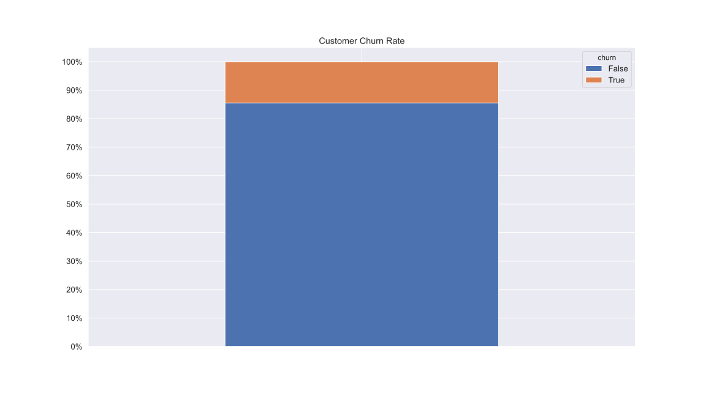
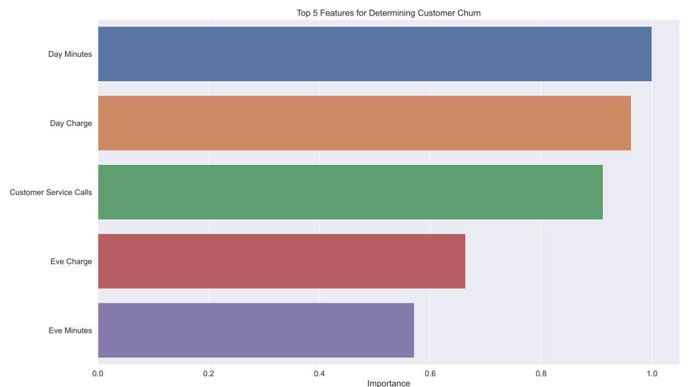
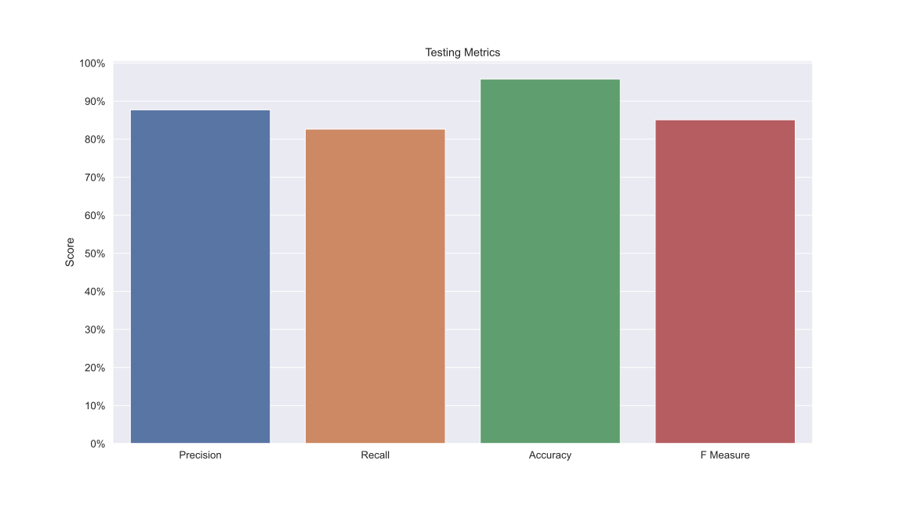
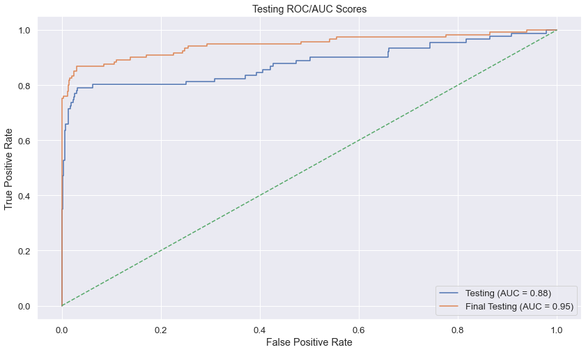

## Predicting Customer Churn

Modeling SyriaTel's Customer Base <!-- .element: style="font-size: x-large;" -->

---

## Problem Statement

SyriaTel Inc. has recently seen a decrease in their profits. <!-- .element: style="font-size: x-large;" -->
Attributing the profit loss to their customer base decreasing, SyriaTel would like
to identify which customers will soon end their service plan so they can focus on
keeping those customers satisfied. 

Note:

Our goal was to make a model which can identify which customers would soon end their service plan.
Using predictive modeling we were able to achieve a 96% accuracy with our predictive model.

---

## Business Value

Recent data shows that the churn rate for SyriaTel is approx. 15%.  
With a medium-sized customer base it's vital to keep as many customers as possible to limit profit loss. <!-- .element: style="font-size: x-large;" -->

  

Note:

In the long run losing a consistent rate of customers leads to large profit loss.
Although profit data was not disclosed to our team, we generally know that in order
to mitigate profit loss, we'll have to mitigate the customer churn rate.

---

## Methodology

1. Obtaining customer logs
2. Scrub/Clean inconsistencies
3. Explore our data
4. Model customer churn
5. Interpret model

Note:

1. Our team was given a log of customer data for the previous 2 months
2. Luckily data was already consistent and clean
3. Our exploration showed us that no one feature alone explains why a customer leaves
4. Modeling our data we were able to generate achieve a 96% accuracy during tests

---

## Model Interpretation

1. Customers who use their service plan the most are more likely to leave. <!-- .element: style="font-size: x-large;" -->
2. The more customer service calls a customer makes, the more likely the are to leave. <!-- .element: style="font-size: x-large;" -->

--

## Model Top 5 Features

  

--

## Model Test Scores

  

--

## ROC/AUC Scores

  

---

### Recommendation

Add new service plans and/or incentives for customers. <!-- .element: style="font-size: xx-large;" -->

Note:

Our findings conclude that individuals most likely to end their service plan are those
who use their service frequently. As people get charged more for service, they become
more dissatisfied, and seek a service provider who can provide a better rate.

Moving away from a flat rate model, or even providing prepaid service plans would
allow customers to pay a lower rate for the minutes by buying them in bulk.

---

## Future Work

1. Reduce our feature set by removing correlated features <!-- .element: style="font-size: xx-large;" -->
2. Look into customer service calls transcripts and try to predict customer churn through it <!-- .element: style="font-size: xx-large;" -->
3. Identify service plans from other providers which would be preferable to current customers <!-- .element: style="font-size: xx-large;" -->

---

# Thank You
